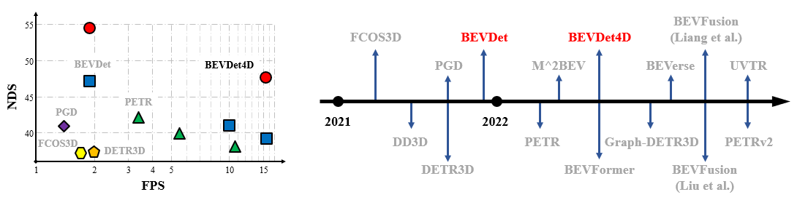

# BEVDet


 
 
## News
* **2022.06.01** We release the code and models of both BEVDet and BEVDet4D!
* **2022.04.01** We propose BEVDet4D to lift the scalable BEVDet paradigm from the spatial-only 3D space to the spatial-temporal 4D space. Technical report is released on arixv. \[[BEVDet4D](https://arxiv.org/abs/2203.17054)\].
* **2022.04.01** We upgrade the BEVDet paradigm with some modifications to improve its performance and inference speed. **Thchnical report of BEVDet has been updated.** \[[BEVDetv1](https://arxiv.org/abs/2112.11790)\].
* **2021.12.23** BEVDet is now on arxiv. \[[BEVDet](https://arxiv.org/abs/2112.11790)\].

## Update
* **2022.07.13** Support bev-pool proposed in [BEVFusion](https://github.com/mit-han-lab/bevfusion), which will speed up the training process of bevdet-tiny by +25%.
* **2022.07.08** Support visualization remotely! Please refer to [Get Started](https://github.com/HuangJunJie2017/BEVDet#get-started) for usage.
* **2022.06.29** Support acceleration of the Lift-Splat-Shoot view transformer! Please refer to \[[Technical Report](https://arxiv.org/abs/2112.11790)\] for detailed introduction and [Get Started](https://github.com/HuangJunJie2017/BEVDet#get-started) for testing BEVDet with acceleration.

## Main Results
| Method            | mAP      | NDS     | FPS    |Mem (MB) |   Model | Log
|--------|----------|---------|--------|-------------|-----|-------|
| [**BEVDet-Tiny**](configs/bevdet/bevdet-sttiny.py)       | 30.8     | 40.4    | 15.6   |11,965| [google](https://drive.google.com/file/d/10innSxqN7NgbktrlfPjWjE7gz-xpbJO_/view?usp=sharing) / [baidu](https://pan.baidu.com/s/1DBxJXgtrW1_7McPSM_koyA?pwd=tbac)        | [google](https://drive.google.com/drive/folders/1VnJv-dNb6-gkKTq7uC_Q6YsRq_q3NI-t?usp=sharing) /[baidu](https://pan.baidu.com/s/1uv81CE34AhYbrz4247QcYA?pwd=k2ms) 
| [**BEVDet4D-Tiny**](configs/bevdet4d/bevdet4d-sttiny.py) | 33.8     | 47.6    | 15.5   |11,557| [google](https://drive.google.com/file/d/1nyQfp7Gt-xbXDzcw5ritmFb8lvPM1H6n/view?usp=sharing) / [baidu](https://pan.baidu.com/s/1n9sVR6FnfmMccSJFTsVKfw?pwd=nzi1)        | [google](https://drive.google.com/drive/folders/1VnJv-dNb6-gkKTq7uC_Q6YsRq_q3NI-t?usp=sharing) /[baidu](https://pan.baidu.com/s/1uv81CE34AhYbrz4247QcYA?pwd=k2ms) 

## Get Started
#### Installation and Data Preparation
Please see [getting_started.md](docs/getting_started.md)

#### Estimate the inference speed of BEVDet
```shell
# with acceleration
python tools/analysis_tools/benchmark.py configs/bevdet/bevdet-sttiny-accelerated.py $checkpoint
# without acceleration
python tools/analysis_tools/benchmark.py configs/bevdet/bevdet-sttiny.py $checkpoint
```

#### Visualize the predicted result with open3d.
**Official implementation. (Visualization locally only)**
```shell
python tools/test.py $config $checkpoint --show --show-dir $save-path
```
**Private implementation. (Visualization remotely/locally)**
```shell
python tools/test.py $config $checkpoint --format-only --eval-options jsonfile_prefix=$savepath
python tools/analysis_tools/vis.py $savepath/pts_bbox/results_nusc.json
```
## Acknowledgement
This project is not possible without multiple great open-sourced code bases. We list some notable examples below.
* [open-mmlab](https://github.com/open-mmlab) 
* [CenterPoint](https://github.com/tianweiy/CenterPoint)
* [Lift-Splat-Shoot](https://github.com/nv-tlabs/lift-splat-shoot)
* [Swin Transformer](https://github.com/microsoft/Swin-Transformer)

Beside, there are some other attractive works extend the boundary of BEVDet. 
* [BEVerse](https://github.com/zhangyp15/BEVerse)  for multi-task learning.
* [BEVFusion](https://github.com/mit-han-lab/bevfusion)  for acceleration, multi-task learning, and multi-sensor fusion. (Note: The acceleration method is a concurrent work of that of BEVDet and has some superior characteristics like memory saving and completely equivalent.)

## Bibtex
If this work is helpful for your research, please consider citing the following BibTeX entry.
```
@article{huang2022bevdet4d,
  title={BEVDet4D: Exploit Temporal Cues in Multi-camera 3D Object Detection},
  author={Huang, Junjie and Huang, Guan},
  journal={arXiv preprint arXiv:2203.17054},
  year={2022}
}

@article{huang2021bevdet,
  title={BEVDet: High-performance Multi-camera 3D Object Detection in Bird-Eye-View},
  author={Huang, Junjie and Huang, Guan and Zhu, Zheng and Yun, Ye and Du, Dalong},
  journal={arXiv preprint arXiv:2112.11790},
  year={2021}
}
```
