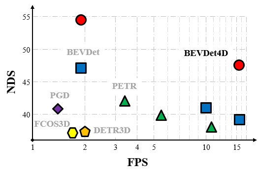

# BEVDet


 
 
## News
* \[2022/4/1\] We propose BEVDet4D to lift the scalable BEVDet paradigm from the spatial-only 3D space to the spatial-temporal 4D space. Technical report is released on [ArXiv](https://arxiv.org/abs/2203.17054).
* \[2022/4/1\] We upgrade the BEVDet paradigm with some modifications to improve its performance and inference speed. [ArXiv](https://arxiv.org/abs/2112.11790).
* \[2021/12/23\] BEVDet is now on [ArXiv](https://arxiv.org/abs/2112.11790).


## Bibtex
If this work is helpful for your research, please consider citing the following BibTeX entry.
```
@article{huang2022bevdet4d,
  title={BEVDet4D: Exploit Temporal Cues in Multi-camera 3D Object Detection},
  author={Huang, Junjie and Huang, Guan},
  journal={arXiv preprint arXiv:2203.17054},
  year={2022}
}

@article{huang2021bevdet,
  title={BEVDet: High-performance Multi-camera 3D Object Detection in Bird-Eye-View},
  author={Huang, Junjie and Huang, Guan and Zhu, Zheng and Du, Dalong},
  journal={arXiv preprint arXiv:2112.11790},
  year={2021}
}
```